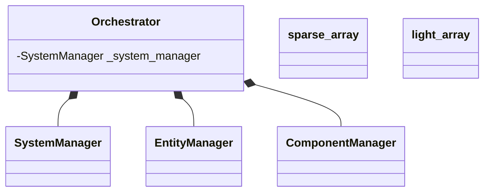

## OtterLib Core

The OtterLib is composed of different static libraries:
- OtterCore
- OtterNetwork
- OtterGraphic

In this section, we'll fly over the OtterCore architecture, which will allow you to create game components and their behavior.

## Core composition

