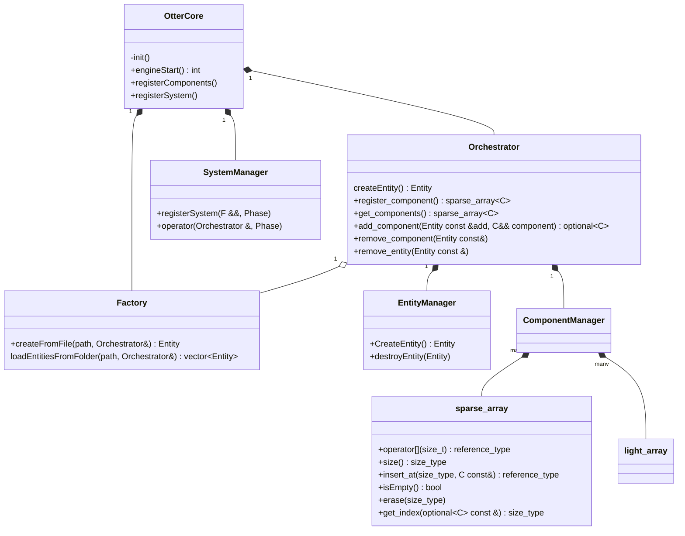

## OtterLib Core

The OtterLib is composed of different static libraries:
- OtterCore
- OtterNetwork
- OtterGraphic

In this section, we'll fly over the OtterCore architecture, which will allow you to create game components and their behavior.

## Core composition

# Core Details

### the core is made of many part; the essential one are:
- dataManagement (storing game data)
- Execution of function/script (system)
- Factory to create scene of object without touching the code base
- Abstraction of the EndPoint

## DataManagement
### In short, A class who store data and give methode to retrieve them when needed.
#### This class need to:
- [ ] Optimize the space the data take
- [ ] Optimize the speed witch it take to retrive and store
- [ ] Store many type of data
+ [ ] Give a user interface with the less boilerplating

