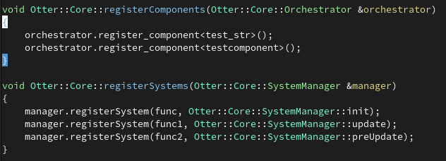

# Tutorial
## How to Create a Component
### Def

A component is a simple class type with data, a constructor, destructor, and other methode to optimaze.   
Can use also other type of storage like struct or simple type.

A composant represent a part of a object. And a object is create by a ensemble a composants.
A composant don't implement logic but only data to be stored and used but in itself he can be used to define if a Entity posses or not a property.

The used of the composant is varied and depend of the user, So be creative!!
### Let practice 

You know now what is a composant and is basic use. but what is real aplication.

Let define some composant that we will use in the next chapter:
- a Transform -> represent the position in diferent aspect of a object (in 3d)
- a Player -> is used more for define a entity with the tag player than a generic purpose
- a Velocity -> represent the moving variation when accelerating and slowing.

``` C++


class Transform {
public:
	int x;
	int y;
	int z;

	Transform(int, int, int);
	~Transform();
	...
	vector<int> conver_to_vector();
}

struct Player{
public:
	std::string name;
	int id;
	Player(int, std::string);
	~Player();
	...
}

class Velocity{
public:
	float speed;
	int x_dir;
	int y_dir;
	Velocity(float basespeed);
	~Velocity();

	void setDir(int, int);
	void setSpeed(flaot);
	...
}

```
> See Also Factory/Buildable composant

> See Also Network/Neworkable Variable
## how to Create a System
A system is a single function, So it can be:
- a lambda
- a primive function
- a operator() methode

but It need to have this prototype ```void ()(Orchestrator &);```

### Let create a move system
#### 1. Create the prototype

```c++
void moveSystem(Orchestrator &data)
```
#### 2. Chose the identity   

Now we need to give a identity to our system.

What will give a identity to a system is, _withc_ data he touch and _what_ he do on hit.  
So let start by the _what_:
+ [ ] this system will move all player by a speed in a the righ ( for doing run).   
with this we evalue _witch_ component we need.
for updating a player movement we need a entity who possese:
- [ ] a composant player
- [ ] a composant transform (contain all position relative data)
- [ ] a composant Velocity (if we want to apply a acceleration system in the next par)

#### 3. get a components

When writing your system you will need to get data from the core.
For this use the public methode _get_component()_ with the type of component you want in the template params.
Next store the result in a Sparse_array<>& (same type as the get).

#### 4. Iteration


nice you have the component list, now is time to use them.
So we start by iterating on them and test if they exist.

> A `sparse_array` is a container who store many component of the same type.
for you understanding a entity represent a index in the array, if the index is empty the entity don't posses the composant.

#### 5. Logic

aazezef
if the condition to enter is complite, we execut some logical computing, like:
- executing a other fonction
- excuting some computing of data
- printing some text
... etc;

### Let see the complite system Code

## Integration

Now you have your system and your component. next is to register them in the core for execute them in real time.

For register Component you need to implement in your game the fonction:    

**void registerComponents(Otter::Core::Orchestrator &orchestrator)**  _Extern fonction define by the core_     
In this fonction you will register all type of component who existe

After, you will need to register system, so implement the fonction :

**void registerSystems(Otter::Core::SystemManager &manager)**    _Extern fonction define by the core_   
in this fonction you will be able to register systems in the core


 _see some exemple of implemnetation of the 2 fonction_

> The fonction for register are all listed in the doc of Orchstrator.


```c++
void shoot_system(Orchestrator &data)
```


```c++
	...
	
sparse_array<component::Player> const &players = data.get_components<component::player>();
sparse_array<component::Event> const &events = data.get_components<component::Event>();
```
 _in less boilerplating way_

```c++
    ...

auto const &player = data.get_components<component::player>();
auto const &events = data.get_components<component::Event>();
```


```c++
void shoot_system(Orchestrator &data) {
    ...

    for (int i = 0; player.size() != i; i++) {
       if (player[i]) {
    	  // Do something
	}
    }
}
```


```c++
    for (int i = 0; player.size() != i; i++) {
       if (player[i]) {
        /*
	     std::cout << Player[i].id << std::endl;
	    //Or
	     Crie_likeKoala(...);
	    //Or
	     player[i].nbTatou += 1;
	    */
	    }
	    ...
	}
```


```c++
void shoot_system(Orchestrator &data)
{
 auto const &player = data.get_components<component::Player>();
 auto const &event = ...
 auto const

 if (event[0].shooting) {
   for (int i = 0; player.size() != i; i++) {
       if (player[i])
       	  if (player[i].bulletNbr < 2)
	     shoot_some(data, bullet, player[i], i);

   }
 }
}

void shoot_some(... &data, ... &bullet, ... &player, ... id)
{
 auto const &bullet = data.get_components<component::Bullet>();
 auto const &transform = data.get_components<component::transform>();
 auto const &dmg = data.get_components<component::stat>();

for (...) {
    if (bullet[i]){
       if (bullet[i].isOut()) {
          transform[i] = tranform[id];
          bullet[i].setCreator(player.id_player);
          dmg[i].dmg = dmg[id].dmg
          return;
	  }
	}
    }
    auto &newEntity = data.createEntity();
    data.add_Component(newEntity, composant::stat(dmg[id]));
    data.add_Component(newEntity, composant::bullet(player.id_player, true));
    ... 	      (newEntity, composant::transform(transform[id]))
    return;
}

```
