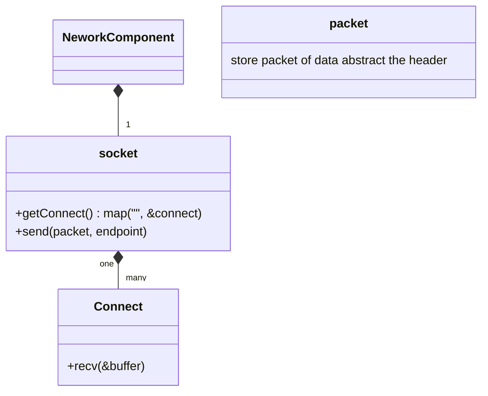
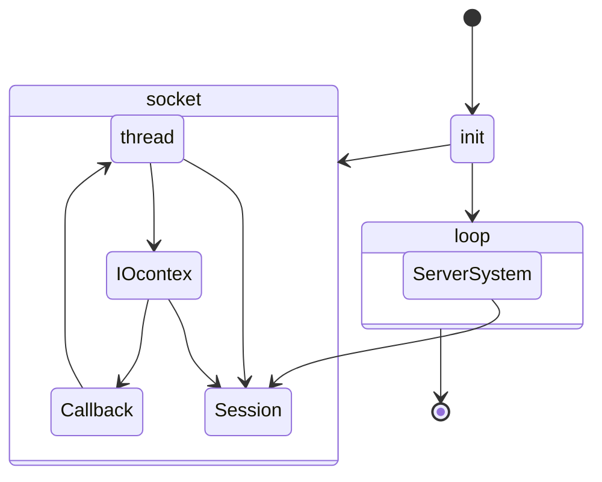
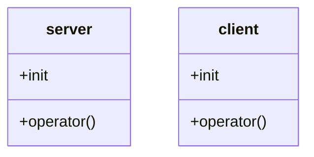
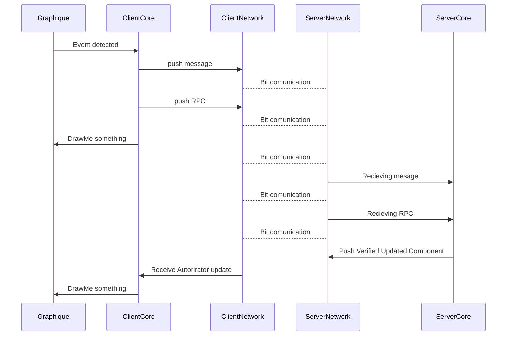

In this section, we'll fly over the OtterCore architecture, which will allow you to create game components and their behavior.

## Core composition

```mermaid
classDiagram

class socket
class NeworkComponent
class Connect {
+recv(&buffer)
}

class packet {
store packet of data abstract the header
}

NeworkComponent *-- "1" socket
socket "one" *--  "many" Connect

class socket {
+getConnect() : map("", &connect)
+send(packet, endpoint)
}

```

```mermaid
stateDiagram-v2

[*] -->init
init-->loop
init-->socket

state loop {
      ServerSystem
}
	loop-->[*]

ServerSystem-->Session

state socket {
thread-->Session
thread-->IOcontex
Callback-->thread
IOcontex-->Session
     IOcontex-->Callback    


}


```

```mermaid
classDiagram

class server {
+init
+operator()
}

class client {
+init
+operator()
}
```

Protocol basic:

the socket 

```mermaid
sequenceDiagram
	Graphique->>ClientCore: Event detected
	ClientCore->>ClientNetwork: push message
	ClientNetwork-->ServerNetwork:Bit comunication
	ClientCore->>ClientNetwork: push RPC
	ClientNetwork-->ServerNetwork:Bit comunication
	ClientCore->>Graphique: DrawMe something
	ClientNetwork-->ServerNetwork:Bit comunication
	ServerNetwork ->> ServerCore:Recieving mesage
	ClientNetwork-->ServerNetwork:Bit comunication
	ServerNetwork ->> ServerCore:Recieving RPC
	ClientNetwork-->ServerNetwork:Bit comunication
	ServerCore->>ServerNetwork: Push Verified Updated Component
	ClientNetwork->>ClientCore: Receive Autorirator update
	ClientCore->>Graphique: DrawMe something
 	
```

