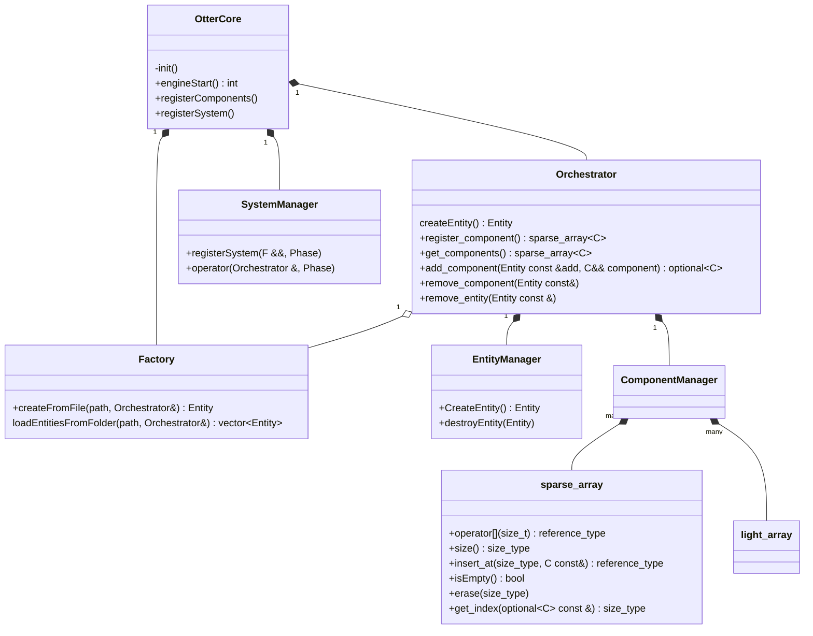
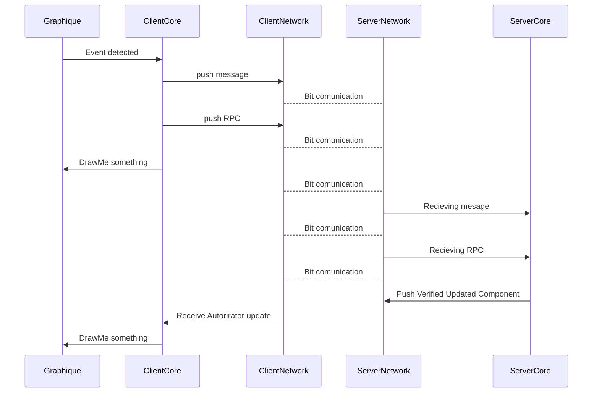

The OtterLib is composed of different static libraries:
- OtterCore
- OtterNetwork
- OtterGraphic

In this section, we'll fly over the OtterCore architecture, which will allow you to create game components and their behavior.

## Core composition



# Core Details

### the core is made of many part; the essential one are:
- dataManagement (storing game data)
- Execution of function/script (system)
- Factory to create scene of object without touching the code base
- Abstraction of the EndPoint

## DataManagement
### In short, A class who store data and give methode to retrieve them when needed.
#### This class:
- [ ] Optimize the space the data take
- [ ] Optimize the speed witch it take to retrive and store
- [ ] Store many type of data
+ [ ] Give a user interface with the less boilerplating

#### Implementation
- The same data are stored in optized a storage
  - > see sparse_array

- Each group of data are stored in a generic way
  - > see component_manager

- Each data are assigned/linked to an Id (entity)
  - > see EntityManager

- All fonctionality a centralize in a user friendly interface
  - > see Orchestrator
## Execution of function/script
### In short, this is the part who run function in a order to permit the game to run.
the fonction are write by the game developer and register in the engine.
> Here  - How to create a system -
## Factory
### A Class implementing a factory from json giving right to creating ensemble of object without coding
  2 ways of creating object:
  * creating from a file
  * creating from folder

## abstract
### main
the main is already implemented.
Actualy the main use 2 fonction who need to be implement by game developpeur
   - registerComponents
>function where we register all component who will be used
   - registerSystems
>function where we register all system who will be used
### Base loop
Implement a actual loop 





```C++
int main() {
}```