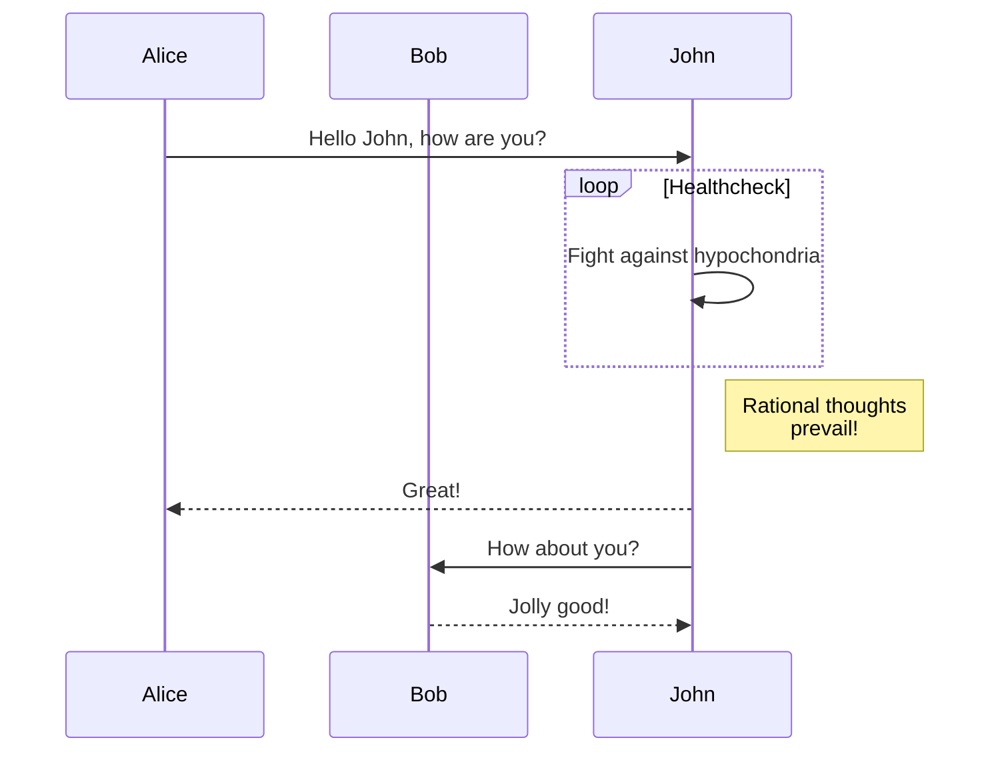
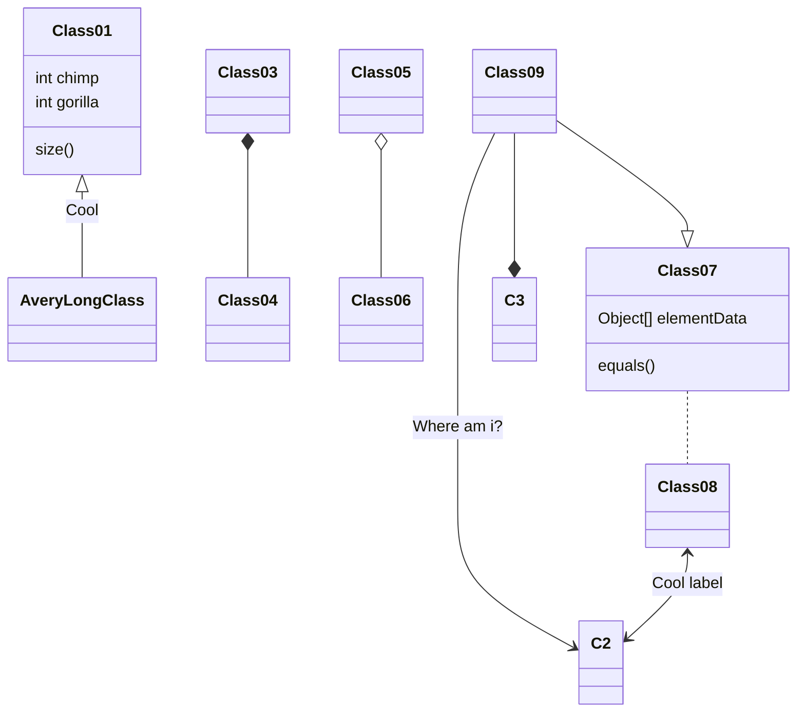

## Learn Retype

Checkout the [Retype website](https://retype.com/components/mermaid/) to learn how to do this

## possible components

Checkout the components you can use [here](https://retype.com/components/)

## Example of Sequence Diagram

## Example of class diagram

